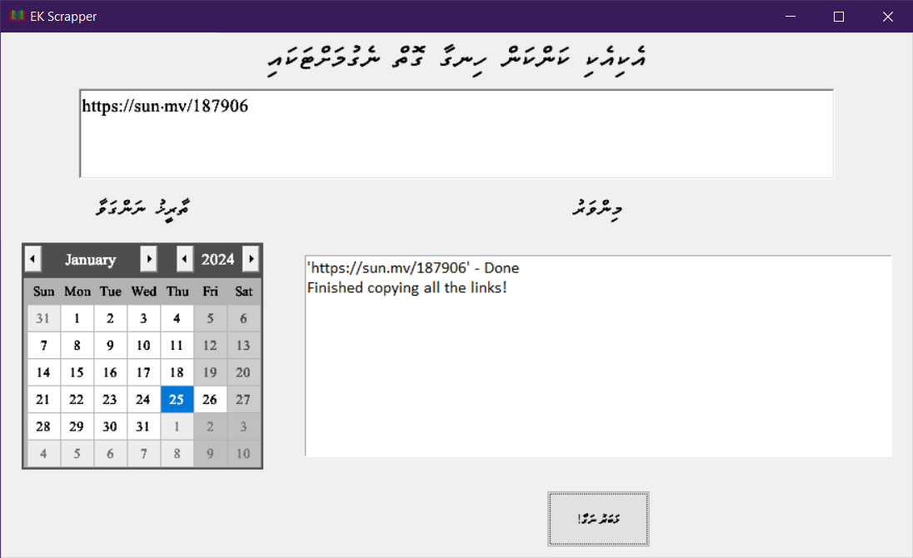

# EK Scrapper
This is a web scrapping tool specifically developed for taking news articles for National Archives of Maldives' "Eki Eki Kan Kan Hingaa". The scrapped news article will be in accord the format specified in the "Eki Eki Kan Kan Hingaa Negun" SOP. The date (in both Gregorian and Hijri) will be generated at the top of each file automatically.

Made in Python using `beautifulsoup` for scrapping and `tkinter` for the GUI element.

### Supported Websites:
- ~~President's Office~~ (No longer supported due to the website having cloudflare protection)
- Sun
- Mihaaru
- Avas

### How to use:
- Paste the link(s) of the website (If more than 1 link, seperate the links using comma)
- Select the appropriate date
- Click the button

